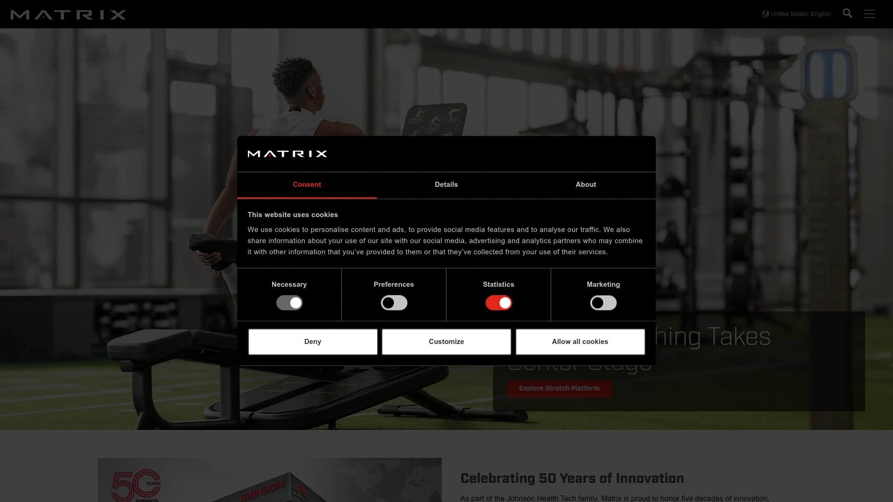

# 2025's 12 Best Commercial Fitness Equipment Brands

You're staring at a blank gym space or a worn-out facility that hasn't seen an upgrade in years. Equipment matters—it's the difference between members who stick around and ones who ghost after a month. Cheap machines break down, frustrate users, and cost more to repair than they're worth. Commercial fitness equipment from reputable brands delivers durability, member satisfaction, and actual return on investment that keeps your doors open.

Whether you're building a new facility from scratch or replacing aging gear, choosing the right equipment supplier impacts everything from startup costs to long-term maintenance headaches. The brands below have proven track records in gyms, hotels, universities, and training centers worldwide.

## **[Life Fitness](https://www.lifefitness.com)**

The industry standard for facilities that need equipment built to survive heavy daily use.

Founded in 1977 in Illinois, Life Fitness pioneered electronic fitness machines and has since grown into one of the most recognizable names in commercial gym equipment. They've acquired Hammer Strength, Cybex, and SCIFIT over the years, giving them comprehensive coverage across cardio, strength, and rehabilitation markets. Walk into any major gym chain, hotel fitness center, or university rec facility and you'll spot Life Fitness machines—they're everywhere because they work.

The company positions itself as a one-stop shop for entire facilities. Cardio equipment includes treadmills, cross-trainers, climbmills, and indoor cycling bikes. Strength offerings range from selectorized machines to plate-loaded equipment and functional training tools. Their Hammer Strength line specifically targets serious athletes and performance training environments with equipment designed to withstand brutal punishment. The SCIFIT line focuses on rehabilitation and therapy settings with machines adapted for physical therapy needs.

Technology integration sets them apart from budget competitors. The Halo Fitness Cloud system tracks machine usage, member performance, and maintenance needs across entire facilities, giving operators real data about what equipment gets used and when it needs service. The SE4 Console includes Netflix, virtual routes, and fitness tracking all integrated into cardio machines. Self-powered machines generate their own electricity when in use, cutting energy costs and simplifying placement since they don't need to be near outlets.

Build quality is serious—robotically welded frames maintain structural integrity even under constant heavy use. Coach Zone Integration combines visual prompts with LED lights and video guides for effective small group training sessions. Machines are tested to exceed industry standards, which explains why they hold up in high-traffic gyms where cheaper brands fail.

The downside is price. Life Fitness gear costs more upfront than most competitors, and the complexity of some consoles requires trained staff to help members navigate features. For smaller gyms or budget-conscious facilities, the investment might exceed what's necessary. But for high-volume operations that need equipment to survive years of punishment, Life Fitness delivers reliability that cheaper alternatives can't match.

## **[Technogym](https://www.technogym.com)**

Italian-designed equipment that brings luxury aesthetics and cutting-edge technology to premium facilities.

Based in Italy and founded in 1983, Technogym has supplied equipment to multiple Olympic Games starting with Sydney 2000 and continuing through recent events. This Olympic partnership demonstrates the brand's ability to meet elite athlete standards while making those same features accessible to regular gym members. The company blends elegant Italian design with serious performance capabilities, making it popular in luxury hotels, celebrity home gyms, and high-end fitness clubs worldwide.

Their equipment stands out visually—sleek, modern designs with clean lines that elevate facility aesthetics. The Unity Console system provides HD touchscreen displays with cloud connectivity, performance tracking features, and integration with the Technogym Live platform. This digital ecosystem lets users track progress, connect with trainers, and sync workout data across devices and apps, adapting to modern fitness lifestyles.

The product range covers cardio machines like the Skillrun treadmill with running, sled, and parachute modes, plus the Excite Live series and Cardio Wave for low-impact cardio. Strength equipment includes the Biostrength line with biomechanically optimized design and the Isotonic line that revolutionized strength training through ergonomic and biomechanical precision. Everything connects through the Mywellness platform for digital fitness integration.

Technogym focuses heavily on wellness beyond basic exercise. Their approach emphasizes holistic health and well-being with personalized workout programs based on user data and goals. This wellness angle attracts facilities targeting upscale clientele who expect more than basic gym equipment. The brand's visibility and trust factor make it appealing for spas, luxury hotels, and premium residential buildings.

Pricing sits at the high end—often more expensive than Life Fitness or Precor. The investment makes sense for facilities where brand image and aesthetics matter as much as functionality. Budget-conscious operators or facilities focused purely on performance might find better value elsewhere. But for establishments where equipment serves as a visual statement about quality and luxury, Technogym delivers that premium positioning.

## **[Precor](https://www.precor.com)**

Biomechanically engineered equipment trusted by hospitality and high-end commercial clubs for over 40 years.

Precor got its start in 1980 creating home fitness equipment before revolutionizing the industry by introducing the world's first elliptical in 1995. That innovation set the tone for a company that prioritizes biomechanics and natural movement in every machine they design. Based in Washington, they've grown into a mainstay in professional gyms, hotels, universities, and corporate wellness centers across 100+ countries.

The Adaptive Motion Trainer (AMT) is their standout product—it allows users to change stride length and movement patterns in real time, giving customizable workouts that adapt to individual needs. This biomechanical focus extends across their entire lineup. Cardio machines emphasize smooth, natural motion that reduces joint stress while delivering effective workouts. Strength equipment is designed with comfort and efficiency in mind, using advanced motion technology that mimics how bodies actually move.

Recent additions include the Breakaway Treadmill with rubberized slats for impact absorption and a "Push Mode" that converts the treadmill into a sled-style workout for HIIT training without additional equipment. The new P31S LED console and existing P94/P84 touchscreen consoles give facilities flexibility in choosing performance and entertainment features. Precor has also partnered with Peloton to offer curated running, walking, and hiking classes on their treadmills.

Beyond cardio, their strength lineup includes the Glutebuilder line engineered with precise biomechanics for targeted glute training. Wellness offerings expanded to include red light and contrast therapy technology exclusively from Precor. They've also partnered with Stages for energizing indoor cycling bikes suitable for studios or fitness floors.

Service and support are key differentiators. Precor operates as more than just a product supplier—they provide full-service, total fitness solutions with a network of sales, support, and service partners ensuring help is available when needed. Their experience working with hotels, commercial clubs, and corporate wellness facilities means they understand diverse market needs.

The equipment costs more than mid-range brands but less than ultra-premium options like Technogym. Quality justifies the price for facilities that prioritize member comfort and long-term durability. Precor machines feel smooth and natural during use, which members notice and appreciate.

## **[Matrix Fitness](https://us.matrixfitness.com)**

Fast-growing brand offering advanced technology and affordability for various commercial environments.

Matrix has become one of the fastest-growing commercial gym equipment brands by combining durability, advanced technology, and competitive pricing. Part of the Johnson Health Tech family, they serve full-scale commercial gyms, boutique studios, corporate wellness centers, athletic performance facilities, apartment complexes, and campus rec centers. Their broad product range covers cardio, strength, and group training equipment with innovative solutions like the Connexus functional trainer that's highly customizable with cable machines, storage, rope capability, and more.

Technology integration is strong across their lineup. The XIR and XUR displays come iFit enabled with preloaded apps, web browsing, diverse onboard workout programs like Virtual Active and Sprint 8, and HDMI plugins for endless streaming options. An iFit membership isn't required to access other console functions, which users appreciate. Matrix equipment features advanced connectivity options that seamlessly integrate workouts with fitness apps, streaming services, and personal devices.

Build quality emphasizes durability and reliability. Treadmills include heavy-duty motors (3.25 HP DC motors that handle running and heavy use quietly), Ultimate Deck System cushioning that feels firm but offers great absorption, and steel frames with sturdy uprights. Many machines offer folding designs that fold up to almost 90 degrees for space savings when not in use. The brand provides lifetime warranties on frames, motors, and cushioning for treadmills, showing confidence in longevity.

User reviews are generally positive. Customers praise the build quality, smooth mechanics, quiet operation, and value compared to premium brands. One reviewer noted their Matrix elliptical felt like "equipment easy to use and a great fit for someone who doesn't want to commit" to subscription services. Another said "If you are choosing between Life Fitness brand and Matrix brand, Matrix is far better", though this assessment varies by specific equipment category.

Some criticisms exist. Taller users report limited range of motion on certain machines, and ergonomics receive mixed feedback compared to brands like Cybex, Hammer Strength, or Life Fitness. A gym owner complained that movements on some machines feel static and don't glide well, with adjustment knobs that are hard to use. However, these complaints appear isolated to specific models rather than the entire product line.

Pricing sits below Life Fitness and Technogym while delivering comparable features and performance. For facilities that need reliable equipment without paying ultra-premium prices, Matrix offers excellent value. They're particularly attractive for startups, apartment complexes, and mid-tier gyms working within budgets.

## **[Hammer Strength](https://www.lifefitness.com/en-us/brands/hammer-strength)**

Performance strength equipment built to a higher standard for elite athletes and serious training facilities.

Gary Jones founded Hammer Strength in 1989 with input from the Cincinnati Bengals and elite athletes, developing strength training machines that simplified biomechanics while matching machine movement to human motion. That focus on performance hasn't changed in over 30 years. Today, Hammer Strength is the #1 brand for elite athletes because it's designed to provide results and built to withstand the pounding that serious training dishes out.

The equipment is found in elite athletic facilities worldwide. Rugged performance strength training equipment is the most durable on the market, designed to withstand the most intense workouts. The portfolio includes heavy-duty racks and rigs, benches, selectorized equipment, plate-loaded systems, and a wide variety of accessories for endless training possibilities. The ISO-Lateral line uses independent motion arms that let each limb work separately, addressing strength imbalances while building functional strength.

Build quality is serious. Equipment is tested to exceed industry standards, ensuring it holds up to years of intense training programs. Frames are fully welded for maximum structural integrity. Brandon Motley, owner of Motley Fitness, said "Hammer Strength is built to such a high standard" when explaining why he chose it for his facility. The brand's reputation for durability makes it attractive for colleges, professional sports teams, military training facilities, and serious commercial gyms.

The Hammer Strength Official Training Center program recognizes elite facilities that outfit with 20+ pieces of Hammer Strength equipment. This designation signals to members that the gym is committed to serious training with the best gear available. The branding value helps facilities attract athletes and hardcore lifters who recognize Hammer Strength as the gold standard.

Pricing reflects the performance positioning. Plate-loaded machines run $2,999-$3,999, power racks and cages $3,899-$4,099, and selectorized machines $3,699-$4,199. These prices exceed budget brands but deliver reliability and performance that justifies the investment for facilities serving serious athletes. The equipment also holds resale value well due to strong brand recognition and built-to-last construction.

For facilities focused on performance training, strength and conditioning, or attracting serious lifters, Hammer Strength is the obvious choice. Casual gyms or budget facilities might find the cost and intensity overkill for their member base. But where performance matters most, nothing matches Hammer Strength's combination of biomechanics, durability, and reputation.

## **[Cybex](https://www.lifefitness.com/en-us/brands/cybex-fitness-equipment)**

High-performance equipment backed by exercise science research and biomechanical innovation.

The Cybex Research Institute leads the fitness industry in providing scientific basis for exercise machine development. With over 90 patents, Cybex equipment is innovative in design, durable in structure, and engineered to be biomechanically correct. For over 40 years, their team of designers and engineers have focused on achieving real scientific results and meaningful innovations in pursuit of fitness perfection.

The product line encompasses a wide selection of strength training equipment including selectorized, modular, plate-loaded, and free weights. The cardio portfolio includes treadmills and bikes, plus the revolutionary Arc Trainer that offers joint-friendly, low-impact motion for high-efficiency workouts. The Arc Trainer specifically focuses on alternative motion cardio backed by exercise science, ideal for general exercisers and rehabilitation applications.

The new Cybex Ion Series features expertly engineered resistance systems that move in ways creating smooth and natural feel for users. The low-profile design offers intuitive functionality, and the space-saving equipment features striking, consistent aesthetics that upgrade facility appearance. Biomechanics drive every design decision—equipment is built with the science of human movement in mind.

Cybex serves diverse market segments including fitness clubs, YMCAs/JCCs, sports teams, colleges, military facilities, country clubs, and workplace fitness centers. The power of the brand also makes it attractive for hotels, spas, and upscale home gyms. Products are designed and produced in a state-of-the-art U.S. manufacturing facility and sold to 90 countries globally.

The equipment is built to go the distance—turning workouts into experiences through reliable performance. Manufacturing excellence comes from an experienced, dedicated workforce committed to quality. Cybex continues introducing new products reflecting the company's heritage of exercise science and innovation.

Pricing varies by product line. Arc Trainers range $1,695-$2,795 depending on console options and condition. Strength machines typically run $3,000-$7,000 new depending on complexity and features. The investment makes sense for facilities that value scientifically backed equipment design and biomechanical precision.

## **[Precor](https://www.precor.com)**

[Content already covered above - this appears to be a duplicate. Continuing with next brand...]

## **[Nautilus](https://www.nautilus.com)**

Strength training pioneer with over 50 years of biomechanical innovation and science-backed equipment design.

Nautilus is literally the gold standard in fitness—widely considered the founder of the modern commercial gym. For over 50 years, Nautilus has redefined fitness through science-backed innovation, creating iconic, performance-driven gear to help people move better, get stronger, and live healthier. Their legacy of innovation introduced many foundational fitness equipment concepts still used industry-wide today.

The Inspiration line delivers must-have updates to outstanding strength circuits. Redesigned with beautiful modern aesthetics and uniform towers, Nautilus Inspiration makes a powerful first impression. Each machine captures the essence of natural movement with easy-to-use features like the patented Lock N Load weight selection system, wrap-around assisted seat adjustment, lenticular image placards, pre-stretch, and range of motion controls—all designed to enhance user experience.

The HumanSport line uses cable-based machines with dual weight stacks providing a complete range of total body training workouts. The HumanSport Freedom Trainer is truly versatile, offering over 100 unique positions in 9.5 square feet of functional training space. The system is so simple, intuitive, and natural that it feels custom-built for each user.

The Glute Drive piece safely and smartly isolates glutes through a strong hip bridge motion, creating improved hip and core stability while building power. These benefits are universally desirable, important for a wide variety of sports and exercises, and arguably the most important muscles for total athleticism. The equipment gives full benefits of hip thrust exercises simply, safely, and with good form.

The Half Rack accommodates a wide range of exercises, movements, and users from beginner to professional athlete. The open-front design lets users move freely and allows use of various benches. Optional SVA Platform and band pegs make it perfect for athletic training and Olympic-style lifting. The shorter 97" tower fits facilities with lower ceilings, and compact design with built-in plate storage makes it ideal for schools, personal training facilities, and larger gyms.

Products are proudly made in the USA. Nautilus equipment emphasizes natural motion for optimal muscle engagement with precision biomechanics designed to enhance strength training results. Durable construction is built to withstand commercial usage over long periods.

Pricing is competitive within the commercial segment. Impact series machines range $4,999-$6,199 new, Inspiration series $5,999-$6,399, and Leverage series $3,999-$4,699. These prices sit below ultra-premium brands while delivering proven performance and reliability backed by decades of experience.

## **[Rogue Fitness](https://www.roguefitness.com)**

American-made strength and conditioning equipment trusted by CrossFit boxes, powerlifters, and serious home gyms.

Founded in 2006 in Ohio, Rogue Fitness has become synonymous with premium quality, durability, and innovation in strength equipment for CrossFit, powerlifting, Olympic lifting, and serious training environments. Their commitment to American manufacturing and exceptional product quality sets them apart from imported alternatives. Power racks, rigs, barbells, weight plates, and specialty items are built to withstand the most demanding training, from commercial CrossFit boxes to dedicated home gyms, with robust steel construction and meticulous craftsmanship.

The equipment is popular because it's built to professional standards. Products are trusted by the best in the business and found in elite training facilities worldwide. Rogue has been the official sponsor of the CrossFit Games and Arnold Classic for years, demonstrating their commitment to supporting serious athletes. Testing and quality control ensure that equipment leaving their Ohio facility meets exacting standards.

The product range covers everything needed for strength and conditioning. Power racks and rigs come in countless configurations from basic home models to full commercial installations. Barbells are manufactured in-house through forging processes that create incredibly durable, precisely machined bars. Weight plates, kettlebells, dumbbells, benches, and specialty equipment round out comprehensive offerings. Rogue also provides customization options for commercial facilities wanting branded or color-matched equipment.

Build quality is outstanding. One Reddit user building a home gym said "They're so solid and well constructed and made in the USA. My Rogue rack and barbell will outlast me". The heavy-duty construction means equipment doesn't flex, wobble, or degrade even under brutal daily use. American manufacturing ensures consistent quality and supports domestic jobs, which matters to many buyers.

Customer service and support receive high marks. The company provides comprehensive assembly instructions, responsive customer service, and warranty support. For commercial installations, Rogue works with facilities on layout planning and custom builds. Their extensive website includes detailed specifications, comparison tools, and educational content helping buyers make informed decisions.

Pricing reflects the quality and American manufacturing. Basic power racks start around $1,000, but full commercial rigs can run $3,000+ depending on configuration and accessories. Barbells range $295-$500+ depending on type and finish. While not the cheapest option, Rogue delivers value through longevity and performance that budget brands can't match.

For CrossFit boxes, strength-focused gyms, or serious home setups, Rogue is the go-to brand. Their reputation among athletes and coaches means having Rogue equipment signals commitment to quality. Facilities focused primarily on cardio or general fitness might find better value in brands offering more complete equipment packages.

## **[StairMaster](https://www.stairmaster.com)**

Iconic cardio equipment brand synonymous with intense stair climbing workouts and HIIT training.

StairMaster launched in 1983 at the National Sporting Goods Association trade show with the StairMaster 5000, a rotating staircase machine. The brand became so widely used that people referred to nearly all step climbers as StairMasters, similar to how Kleenex became synonymous with tissues. That brand dominance continues today as a line of Core Health & Fitness, offering some of the toughest workouts available in gyms.

The StairMaster 8Gx Gauntlet is their flagship product, combining robust build with advanced workout features like the Landmark Challenge Program that lets users virtually climb iconic landmarks. With 25 resistance levels and ergonomic handrails designed for physical safety and performance, it delivers serious cardio challenges. The StepMill is the treadmill version of stairs—a machine that feeds continuous stairs ranging from 26 to 162 steps per minute.

Beyond stair climbers, StairMaster now offers HIIT equipment. The HIIT Bike provides dual-action wind resistance for full-body workouts that scale with user effort. Heavy-gauge welded steel construction ensures durability while the LED display tracks key metrics. The HIIT Rower features isokinetic fan resistance that adjusts to user intensity, making it ideal for both beginners and seasoned athletes. Compact design and easy storage make it versatile for various facility types.

The HIITMill X is a self-powered treadmill designed for high-intensity workouts with a fixed 11-degree incline and magnetic resistance brake. It supports various exercises from sled pushes to lateral lunges, catering to diverse training needs. From the makers of the toughest workouts in the gym comes a fierce High Intensity Interval Training program that leaves users hurting for more.

Commercial quality is built into every machine. StairMaster equipment is designed for heavy commercial use in facilities with high foot traffic. The StepMill provides an advanced workout experience—one user recalled "using this machine in college and being completely gassed out after just a few minutes". For facilities wanting to offer genuinely challenging cardio that differentiates them from basic treadmill gyms, StairMaster delivers that intensity.

Pricing reflects commercial quality. The Gauntlet 8G runs around $8,899-$10,199, the Gauntlet 10G approximately $11,549-$13,299, and the 4G model around $5,999-$7,299. The StepMill costs approximately $3,800. These prices position StairMaster as a premium cardio option, but the equipment lasts for years in high-traffic environments.

## **[Sole Fitness](https://www.soletreadmills.com)**

Award-winning equipment combining commercial quality with affordability for home and light commercial environments.

Sole Fitness began designing treadmills for rigorous use in hotels across the US and Canada over 20 years ago. The Sole F80 and F85 introduced back then are still the highest-rated treadmills in the market. Sole is a premium brand in the fitness industry, highly committed to customers and dedicated to offering budget-friendly, high-quality fitness equipment for homes and fitness centers.

Products consistently earn "Best Buy" reviews and ratings on reputable customer review sites and fitness magazines. The engineering and design team never stops thinking about ways to improve technology and provide the best customer experience. Whether you're a fitness fanatic or just getting started, Sole equipment offers training solutions that deliver results.

The F89 Treadmill is designed for serious runners and fitness enthusiasts demanding commercial-level performance at home. The E95 ENT Elliptical brings commercial gym power into home environments with durable construction and smooth, low-impact full-body workouts. Light Commercial Recumbent Bikes blend comfort, performance, and smart technology—perfect for home users and light commercial environments like rehab centers, hotels, and corporate gyms.

The SRVO All-in-One Trainer is completely redesigned, combining a bar, weight plates, bench, and half-rack. This powerhouse ensemble engages muscles while promoting functional strength and agility. The SOLE+ app provides workouts for all Sole equipment with 3,000+ workouts made for all levels ranging from 10 to 60 minutes. They utilize heart rate metrics and equipment data across workouts to help users train smarter.

Treadmills feature heavy-duty motors that handle running and heavy use quietly, Ultimate Deck System cushioning, and steel frames ensuring longevity. Ellipticals include heavy flywheels, adjustable pedals, and whisper-quiet motion delivering smooth, low-impact workouts with no subscription required. The E25 and E35 models feature 20 different incline levels to sculpt and strengthen major lower body muscle groups.

Pricing delivers excellent value. Treadmills range $1,799-$2,699, ellipticals $1,299-$2,099, and the SRVO system offers complete home gym functionality at competitive prices. Sole provides solid warranties and customer reviews praise the quality relative to cost. For budget-conscious facilities or serious home gym builders, Sole delivers commercial-quality performance without premium pricing.

## **[Johnson Health Tech](https://www.johnsonhealthtech.com)**

One of the largest fitness equipment manufacturers globally, owning multiple brands serving diverse markets.

Johnson Health Tech started in 1975 in Taiwan and has grown into one of the largest fitness equipment makers in the world. They now operate in over 60 countries and own several well-known brands including Matrix, Horizon, and Vision. Their focus covers both home and commercial gyms, so whether you're building a small studio or outfitting a full fitness center, they offer gear that fits diverse needs.

The company earned a reputation for consistency and reliability through decades of experience. Their goal of helping people move more, stay healthy, and live better lives drives product development across all their brands. As a parent company, Johnson Health Tech provides manufacturing scale, R&D resources, and global distribution networks that support their individual brands.

The product range includes treadmills, ellipticals, exercise bikes, stair climbers, selectorized weight machines, plate-loaded units, and benches and racks. Technological innovations include the Sprint 8 Training Program (a built-in HIIT system completing workouts in 20 minutes), Virtual Active Programming (immersive scenic video routes syncing with machine movement), and app and device syncing with popular fitness apps like MyFitnessPal and Apple Health.

Low maintenance design with durable parts and fewer moving components helps reduce downtime and maintenance needs. Touchscreen consoles on select models combine workout tracking, entertainment, and internet browsing in easy-to-use interfaces. The engineering focuses on making machines that last while remaining accessible to various user types.

As a manufacturer rather than single brand, Johnson Health Tech's value comes through their portfolio approach. Facilities can work with Johnson brands matching their specific price points and feature needs—Matrix for commercial quality at competitive pricing, Horizon for home and light commercial, Vision for budget-conscious options. This flexibility makes them attractive partners for diverse facility types.

The higher-end products sit on the upper end of price ranges, which could challenge smaller gyms or startups working with tight budgets. However, their deep experience, solid global support, and full lineup of machines for almost every need make them a strong choice for facilities wanting reliable, long-lasting equipment backed by an established global company.

## **[NordicTrack](https://www.nordictrack.com)**

Technology-focused fitness equipment featuring iFit integration and interactive training experiences.

NordicTrack holds the #1 treadmill brand position in the US, demonstrating strong market presence in home fitness. The company focuses on innovative, versatile cardio machines with interactive features that enhance workout experiences. Their equipment integrates heavily with iFit, providing trainer-led classes, virtual routes, and automatic adjustments matching workout programming.

The product lineup covers treadmills, bikes, ellipticals, rowing machines, and strength equipment designed for home use. Technology integration is the primary differentiator—machines automatically adjust incline, decline, and resistance based on iFit programming, creating immersive workout experiences where the equipment responds to on-screen coaching in real time.

Interactive features appeal to users wanting guided workouts and entertainment during exercise. The iFit platform provides thousands of on-demand classes, studio sessions, and outdoor routes filmed worldwide. Trainers control the equipment during classes, creating experiences similar to boutique studio classes at home. This technology focus attracts users motivated by interactive content rather than traditional gym equipment.

Build quality varies by model and price point. Higher-end NordicTrack equipment offers commercial-grade components and durability, while entry-level models focus on affordability with lighter-duty construction. Customer reviews show mixed results—some users love the iFit integration and equipment performance, while others report reliability issues or frustrations with subscription requirements for full feature access.

Pricing spans wide ranges. Basic models start around $800-$1,000, mid-range equipment runs $1,500-$2,500, and premium models reach $3,000-$4,500. The iFit subscription adds ongoing costs ($15-$39/month depending on membership level), which should factor into total ownership calculations.

For home users wanting interactive, technology-driven workouts with guided coaching, NordicTrack delivers compelling options. Commercial facilities might find the iFit dependency and subscription model less suitable than traditional equipment, though some corporate wellness centers and hotels have adopted NordicTrack machines successfully.

## Common Questions

**What's the difference between commercial and home fitness equipment?**

Commercial equipment is built with heavier-duty frames, components rated for 8-12 hours of daily use, and warranties covering high-traffic environments. Home equipment uses lighter construction suitable for 1-2 hours daily. Commercial gear costs 2-3x more but lasts 5-10+ years in gyms where home equipment would fail within months under similar use.

**Which brands offer the best warranty and service for commercial facilities?**

Life Fitness, Precor, and Hammer Strength provide comprehensive commercial warranties typically covering 5-10 years on frames, 3-5 years on parts, and 1-2 years on labor. They also operate extensive service networks with certified technicians available nationwide. Matrix and Technogym offer similar support structures. Budget brands often provide limited commercial warranties requiring self-service for many issues.

**How do I choose equipment that fits my facility's budget and member needs?**

Start by analyzing your member demographics and usage patterns. High-volume gyms need ultra-durable brands like Life Fitness or Hammer Strength despite higher costs. Mid-tier facilities can save money with Matrix or Nautilus while maintaining quality. Budget gyms might mix refurbished premium equipment with new mid-range gear. Always test equipment before buying and negotiate package deals when outfitting entire facilities.

## Wrapping Up

Your gym is only as good as the equipment your members actually use. Cheap gear frustrates people, breaks down constantly, and costs more long-term through repairs and replacements. The brands above have earned reputations through decades of performance in real facilities serving real people daily.

[Life Fitness](https://www.lifefitness.com) stands out because they've solved the single biggest problem gym owners face: finding one reliable partner who can outfit an entire facility with equipment that works together visually and functionally. Hotels, universities, and major gym chains choose them because managing one relationship is simpler than coordinating multiple vendors with inconsistent quality and service. For facilities that need everything from cardio to strength to recovery equipment backed by proven durability, Life Fitness delivers that complete solution without the headaches of piecemeal purchasing.
